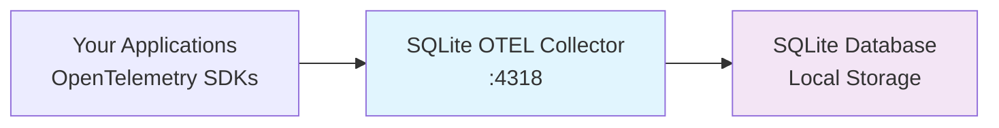

# SQLite OTEL Collector Documentation

A standalone Go binary that functions as an OpenTelemetry collector service, designed to receive telemetry data and persist it to an embedded SQLite database.

## Features

!!! tip "Why Choose SQLite OTEL Collector?"

    - :package: **Single Binary** - No external dependencies, embedded SQLite
    - :rocket: **Lightweight** - Minimal resource footprint for edge deployments  
    - :lock: **Secure by Default** - Non-root execution with systemd hardening
    - :bar_chart: **Full OTLP Support** - Traces, metrics, and logs via OTLP/HTTP
    - :arrows_counterclockwise: **Log Rotation** - Built-in rotation with compression
    - :hammer_and_wrench: **Easy Deployment** - Native packages for all platforms

## Quick Start

=== "Docker"

    ```bash
    # Run with Docker
    docker run -d \
      --name sqlite-otel \
      -p 4318:4318 \
      -v sqlite-otel-data:/var/lib/sqlite-otel-collector \
      ghcr.io/redshiftvelocity/sqlite-otel:latest

    # Send test data
    curl -X POST http://localhost:4318/v1/traces \
      -H "Content-Type: application/json" \
      -d '{"resourceSpans": []}'
    ```

=== "Binary"

    ```bash
    # Download latest release
    wget https://github.com/RedShiftVelocity/sqlite-otel/releases/latest/download/sqlite-otel-linux-amd64
    chmod +x sqlite-otel-linux-amd64
    sudo mv sqlite-otel-linux-amd64 /usr/local/bin/sqlite-otel

    # Run collector
    sqlite-otel
    ```

=== "Package Manager"

    ```bash
    # Ubuntu/Debian
    wget https://github.com/RedShiftVelocity/sqlite-otel/releases/latest/download/sqlite-otel-collector_amd64.deb
    sudo dpkg -i sqlite-otel-collector_amd64.deb

    # RHEL/CentOS/Fedora
    wget https://github.com/RedShiftVelocity/sqlite-otel/releases/latest/download/sqlite-otel-collector-amd64.rpm
    sudo rpm -ivh sqlite-otel-collector-amd64.rpm
    ```

## Architecture



Your applications send telemetry data via OTLP/HTTP to the collector, which immediately persists it to the embedded SQLite database.

## Next Steps

- [Installation Guide](installation.md) - Download and install the collector
- [Quick Start](quickstart.md) - Get up and running in 5 minutes
- [Configuration](configuration.md) - Customize the collector settings
- [CLI Reference](cli.md) - Command-line options and flags